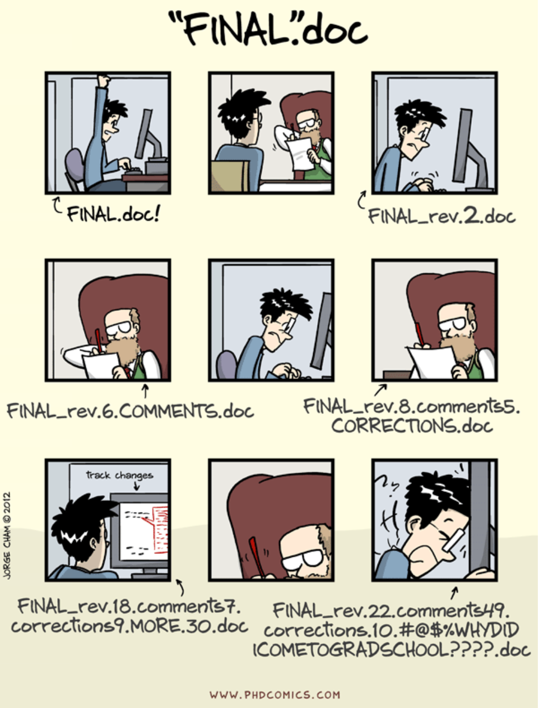
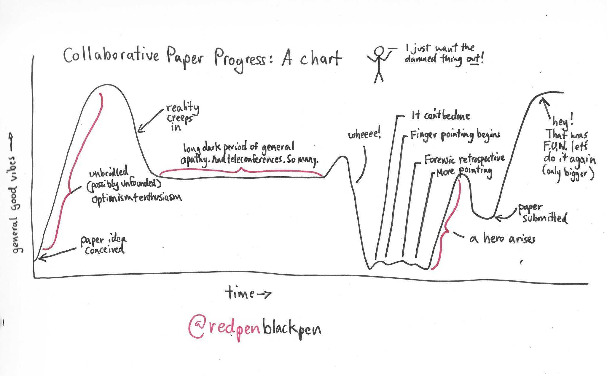

```{r setup, include=FALSE}
options(htmltools.dir.version = FALSE)
knitr::opts_chunk$set(message = FALSE, 
                      echo = FALSE, 
                      warning = FALSE,
                      fig.align = "center")
```

```{r xaringan-themer, include=FALSE, warning=FALSE}
library(xaringanthemer)
style_duo_accent(
  primary_color = "#9F999C",
  secondary_color = "#FFE5F3",
  inverse_header_color = "#8F8C8E",
  link_color = "deeppink",
  title_slide_text_color = "#3d3d3d",
  title_slide_background_image = "img/title-slide-background-light.png",
  title_slide_background_position = "left",
  header_font_google = google_font("Josefin Sans"),
  text_font_google   = google_font("Montserrat", "300", "300i"),
  code_font_google   = google_font("Fira Mono")
)
```

## Reproducible Research

In order to ensure research outputs are robust, and to maximize the time,
money, blood, sweat, and tears that went into it, for future researchers
and for society in general, it is critical that we share the underlying
code and data. 

In these slides, we will attempt to convince you of this.

---

## Have You Ever ...

Karl -- this is very interesting ,
however you used an old version of
the data (n=143 rather than n=226).
I'm really sorry you did all that
work on the incomplete dataset.
- Bruce

*[Source](https://www.biostat.wisc.edu/~kbroman/presentations/repro_research_JSM2016.pdf) from a talk at JSM 2016 by Karl Broman*

---

## Have You Ever ...

You come back to a project, which you know was working, and find that
nothing runs anymore. And what runs, doesn't match what you remember.

**Worse**: the reviewers come back with some positive feedback for your paper,
but ask that you check something in one of the model runs. When you go to do
so ... nothing matches the output in the paper. Not the figures, not the tables,
not the results. What happened??!?

---

## Have You Ever ...

"Your script is giving me an error when I run it on my computer."
- Your Collaborator (*who you used to like*)

---

## Have You Ever ...

```{r phd-comic, out.width="32%"}

```

---

## Have You Ever ...

```{r redpen, out.width="85%"}

```

---

## So Why is It Important?

- your personal sanity

--

- the great scientific endeavor

--

- no, but seriously: your personal sanity

--

- having things "just work", like you expect

--

- avoiding embarrassment

---

## Listen to some others ...

File organization and naming is a mighty weapon against chaos
- Jenny Bryan

---

##  Listen to some others ...

You mostly collaborate with yourself, 
and me-from-two-months-ago never responds to email.
- Mark Holder

---

##  Listen to some others ...

Dear past-Hadley: PLEASE COMMENT YOUR CODE BETTER. Love present-Hadley

— [@hadleywickham](https://twitter.com/hadleywickham/status/718203628528349184)

---

##  Listen to some others ...

The most important tool for Reproducible Research is the mindset, when starting, that the end product will be reproducible.
- [Keith Baggerly](https://twitter.com/kwbroman/status/667735926915731457)

---

class: inverse

## Basic Principles

Basic principles

Step 1: slow down and document.<br/>
Step 2: have sympathy for your future self.<br/>
Step 3: have a system.<br/>

- [Karl Broman, UW-Madison](https://kbroman.org/Tools4RR/assets/lectures/06_org_eda_withnotes.pdf)

---

## Tips for Getting Started in Small Ways

- force yourself to organize your course materials in a coherent manner
(assuming you teach); or a *small* research project, if you don't

--

- use Git to store your materials (make them available freely, if you can!) - more soon

--

- create your slides in R Markdown or an equivalent framework

--

- add one piece of the puzzle with each subsequent project

--

- think of all of your outputs as code (including your teaching!)

---

## A Personal Example

I write all of my slides for my big classes in R Markdown. They are knit
as part of a project, and the entire course is a Git repository. This has
a number of advantages:

- all slides can be publicly available

--

- it is very easy to update a course website (build -> commit -> push)

--

- I never lose old slides - they're all on GitHub

--

- it is trivial to cross-link from lecture to lecture, or to reuse material without making multiple copies

--

- the lectures are **code**

---

## What Do I mean "the lectures are code"?

Depending on how computational your statistics world is, this may not
fully sink in. What is **code**?

- all text (ASCII or UTF)

--

- editable in any environment, on any computer

--

- rendered in some way to form a final product

--

- trivially versionable

--

Compare this to, e.g., a **pptx** (Microsoft Office - Powerpoint). 
Have you ever tried to open a pptx file in anything **but** Powerpoint? 
Or in anything but a slide editor (e.g., Notepad)?

---

## Once You See It

Once you start thinking of almost all of our work product as
examples of code, you start to see how everything can be treated
the same, in terms of workflow, versioning, file organization and
naming, sharing, and so on.


In the next session, we will dive into a version of what we have
been calling **version control**, and introduce the concepts 
necessary to get started. 
