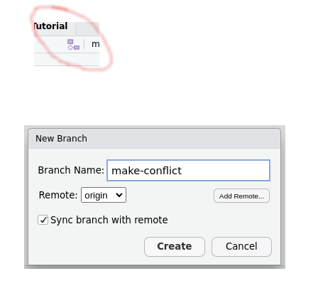

```{r setup, include=FALSE}
options(htmltools.dir.version = FALSE)
knitr::opts_chunk$set(message = FALSE, 
                      echo = FALSE, 
                      warning = FALSE,
                      fig.align = "center")
```

```{r xaringan-themer, include=FALSE, warning=FALSE}
library(xaringanthemer)
style_duo_accent(
  primary_color = "#9F999C",
  secondary_color = "#FFE5F3",
  inverse_header_color = "#8F8C8E",
  link_color = "deeppink",
  title_slide_text_color = "#3d3d3d",
  title_slide_background_image = "img/title-slide-background-light.png",
  title_slide_background_position = "left",
  header_font_google = google_font("Josefin Sans"),
  text_font_google   = google_font("Montserrat", "300", "300i"),
  code_font_google   = google_font("Fira Mono")
)
```

## Framework for 'Doing'

Rstudio projects are a convenient way to manage research projects, providing the scaffolding for robust, self-contained and portable work.

1. Such a framework is key for moving projects from one computer to another 
(always a source of friction, even if it's just laptop vs. desktop, or home
vs. office)
2. A good framework should help:
    - ensure integrity of data, and data processing workflows
    - ensure portability
    - allow easy revisiting later (reduce "bit rot")
    - encourage collaboration
    - support tool building
    
---

## Principles of Projects

1. Everything required for the project is contained internally, or sourced
automatically.
2. All file Input/Output paths and references are relative references, to the
project root, **not** absolute
3. Data, methods, and results/outputs are separated, with clear relationships
4. Documentation of contents is integrated and clear
5. No raw data is **ever** manually edited
6. A clean, clear pipeline is present, taking raw data through processed forms
into modelling
7. Checks are integrated to ensure correctness of processing and analysis stages.

---

## RStudio Projects

RStudio's implementation of projects is designed to support the above discussion.
They allow for a project-by-project suite of configurable settings, including
integration of version control. 

We **strongly** encourage creating such projects as wrappers for each distinct
piece of work you complete using R/RStudio. 

```{r project1, out.width="40%"}

```

---

## What Happens?

When you create a new RStudio Project, RStudio's interface:

1. Creates a project file (with an *.Rproj* extension) within the project directory. This file contains various project options
2. Creates a hidden directory (named *.Rproj.user*) where project-specific temporary files (e.g., auto-saved source documents, window-state, etc.) are stored. This directory is also automatically added to *.Rbuildignore, .gitignore*, etc. if required.
3. Loads the project into RStudio and display its name in the Projects toolbar


```{r project2, out.width="40%"}

```

Our slides and setup for this workshop are an RStudio project!

---

## One Key Configuration Setting

### Version Control

RStudio .Rproj files contain information on your **Version control system**.

RStudio automatically detects the presence of version control for projects by scanning for a .git or .svn directory, if already configured. However, if you have no version
control setup for the project and you want to add a local git repository, this
can be done with the Rproj environments.

---

## Status Check

In your RStudio environment (local or server), you should have already
set up Git, and linked the global settings to your SSH key and account. 

```{r project3, out.width="35%"}

```

---

## Breakout Activity

1. Go to File > New Project
2. Version Control > Git
3. Fill in the boxes as below (this will give you one of the repositories that Tiffany will use in the next module!), then *Create Project*.

```{r project4, out.width=550}

```

---

## Workflow for Portability

In the brief breakout, we pulled a repository from someone else's
(Tiffany's) public-facing GitHub interface, to our computer, as a New Project,
and had the file system, code, documentation, and even libraries, included
along with it!

**Be honest**: in any collaborations you've ever done, where a collaborator
promises they've packaged up everything you need ... has it worked? The first
time? At all?

**This is the power of computational reproducibility, done right!**

---

## Building a Project from Scratch

We'll now step through the workflow required to setup a project from scratch,
with a central record on GitHub. 

**Note**: there's nothing specifically tying you to GitHub, it's just free
to use for private repositories, well-funded enough it isn't going anywhere,
and doesn't require extra technical know-how (e.g., setting up your own
GitLab or equivalent is possible, but not trivial).

---

## Breakout Activity

1. Go to [https://github.com/](https://github.com/). Make sure you are logged in.
2. Click the big green **New** button. Fill in the details as follows.


```{r project5, out.width=500}

```

---

## Breakout Activity

3. Click on the **Code** button (again, green), and click the Copy icon
next to the SSH string.

```{r project6, out.width=500}

```

---

## Breakout Activity

4. In RStudio, start a new project: File > New Project. As with the previous
demonstration, paste in the information you copied from the SSH tab on GitHub.
I usually click "Open in new session".

```{r project7, out.width=500}
knitr::include_graphics("img/04-integration/04-clone-RStudio.png")
```

---

## Breakout Activity

Have some fun! Create a new Rmd in the same directory that was just created
by the cloning action. Edit the README.md file. Create a sub-directory
in that directory, add a file to the subdirectory. Go wild!

Once you've done so, look in the top right of your default interface for
the **Git** tab. 


```{r project8, out.width=400}

```

---

## Recall

We have made changes **locally**. These changes, while saved to disk,
**are not tracked** because they have not been committed to the version
control. They are also not **staged** (yet!). 

1. Select the files and directories you wish to stage.
2. Click the **Commit** button. 
    - (Optional) Poke through the different files, top left, see what has been changed (added=Green; deleted=Red)
3. Add a meaningful message, top right. (We all fail at this ... )
4. Click **Commit** (bottom right).

Now the changes have been both staged and committed ... **locally**. Our computer's
copy of the versioning ledger is up to date. However, our reference copy
on GitHub ... not so much. 

---

## Breakout, Finalized

We have changes made, staged, committed, and preserved locally. Now it's time
to push these changes up to our reference repository on GitHub so they are
saved for whatever purpose we attach to them.

It's very easy, if you did all the setup previously: click the upward facing arrow.
This is a **Push**.

```{r project9, out.width=500}

```

After doing so, go back to GitHub in your browser, and refresh. What do you see?

(if you like, you can Close Project on this in your RStudio now, and then delete
the entire directory)

---

## Onwards and Upwards

Alright, you've successfully created a repository (repo). You've pulled
it down from GitHub into your RStudio environment where you can do things
(unspeakable things!) to it - like add new files, edit, manipulate, organize,
or even, delete! 

Now what? What's the point of all this?

Bluntly, if you don't collaborate, you can quite happily just use this workflow
as demonstrated: pull, do work, stage+commit, push. You'll never have any
issues, you won't use 98% of the functionality of Git, but you'll have 
added a new backup system to your life, and forced your workflow to be a little
more organized, a little less messy, and a little more portable between computers.

Assuming you use only one computer, you will likely never have any issues 
whatsoever with this approach. But who among us doesn't have at least 2 computers
(even if the second is a lab computer, or a personal (home) computer being used because
it's 1am and your lecture isn't ready yet ... ).

---

## We Don't Talk About Merge Conflicts (no, no, no)

As soon as we add one wrinkle to the previous, we can run into the problem of
concurrency, and the dreaded **merge conflict**. 

Allan, Betty and Claire are all collaborating on a [Project]. Allan created
the repository, and Betty and Claire cloned it. They all have permission to 
Push to the repo. 

On Saturday morning, both Betty and Claire pull the latest copy from GitHub. 
They both edit the same file, locally. They both stage+commit. They both
push. Unfortunately for Claire, Betty worked faster, and pushed her version
first. So when Claire goes to push, she gets the Dread (Pirate) Merge Conflict:
her change and Betty's change aren't compatible, but they both started from
the same point! Danger!

---

## Breakout Activity

Tiffany has a lovely little template repository we can use to practice merge
conflicts, without needing a Betty or a Claire to help us. 

Go to [https://github.com/ttimbers/r-cube](https://github.com/ttimbers/r-cube)
and click the green **Use this template** button. This will pop up the
interface to allow you to create a new repository on your personal account.
Call it something sensible like **test-merge**. 

Now, **practice**: can you clone this repository to your local/server 
environment without a reminder?

(Note: look at the version on your personal account - note that there is
1 commit to this repo)

---

## Breakout Activity

Recall what branches do: they create a local **copy** (sort-of, just work
with me here) of all of your work, with the moment just before the copy
preserved in amber in the original branch. You can do whatever you want,
and the original is still preserved. 

It's a great way to separate work out if you're not sure if it will work,
or whether you want to keep it. Highly recommended workflow, if you ever
get past the basics of Git.

We will use the idea in the following slide.

---

## Breakout Activity

Use the Branch icon in RStudio (new!) to create a new Remote branch called
**make-conflict**. 

```{r project10, out.width=400}

```

(Under the hood: Tiffany set this up so that the creation of this branch
triggered a GitHub Action, which ran a script and made a fictitious 
collaborator swoop in and change a file for us)

---

## Breakout Activity

Go back to GitHub. Look carefully at the commits (top right of the main pane).
Notice how there are 2 commits now, not 1?  (you may need to wait ~ 30-60 seconds)

```{r project11, out.width=1000}

```

---

## Breakout Activity

Ignore the fact that our fictitious collaborator has fixed our bug for us.

1. Locally, open **cube.r**. 
2. Fix the code. Save the file.
3. Go to the Git tab: stage+commit. 
4. Push ... or rather, try. What happens? It works ... or does it?!

```{r project12, out.width=500}

```

---

## Breakout Activity

We want to take our change, which fixed a bug, and merge our working
branch (make-conflict) back into the main branch. Little do we know,
this will result in a Dread (Pirate) Merge Conflict!

(at this point, live demo)

---

## Workflows

We have zero expectation that the last 2 hours have made you comfortable
enough with Git to use it in any advanced way. However, as suggested earlier:
if you can begin using the framework on a solo project, and just 
pull > work > commit > push as part of your workflow, you've at least gotten
that far, and have a handy-dandy version controlled backup system in place.

In the remaining few minutes, I will discuss some workflows that may make
sense for you for some of your projects and work life.

---

## The Repeated Amend

Commits are like an anchor - you can always return to a commit, and it is
"set in stone" (as much as something in a directory that can be deleted
willy-nilly is stable). If you have pushed a commit, even better: there's a 
nice copy on the 'cloud' saved for you.

When you are working, it's easy to go many hours without committing. This 
is, generally, a mistake. I tend to commit every time something "works":
a nice plot is rendered? I find that bug I've been searching for? It's
lunchtime? I might have to put down the project for 5 minutes (3 hours later ...)?

But then you have many, many Commits, and it can be tricky in the future
to find a specific moment to return to. 

---

## The Repeated Amend

If, instead of fully committing, with a unique message and a significant
contribution, you just commit regularly and often, you can instead
use the design pattern of **repeated amendment**. When committing in
RStudio, click the "Amend previous commit" button. Every time, for a 
period (e.g., one day).

Then, when you're really ready to put a pin in the changes, commit one
last time as amendment, put a **real** message in the commit window,
and then afterward, push. 

**Note**: do not push regularly in this workflow pattern. Do a bunch of work
locally, amend repeatedly, and only push when you close out the series
of amended commits. 
---

## Burn It All Down

```{r project13, out.width=275}

```

Source: [https://xkcd.com/1597/](https://xkcd.com/1597/)

---

## Burn It All Down

We aren't kidding. This is seriously how you deal with most unsolvable
merge conflicts. Accept one version as 'truth', save the files you've modified
somewhere else, and manually merge your changes back into the 'truth' repo. 

... I do this more often than I like admitting to ... 

**Do as I say, not as I do!**

---

## Fork and Clone

Use "fork and clone" to get a copy of someone else’s repo if there’s any chance you will want to propose a change to the owner, i.e., send a "pull request".

If you are collaborating directly with someone, this is not the best workflow:
just share a repo directly, and both (or all) of you push/pull from the same
repo. 

Fork and clone is where you might contribute to someone else's project. For example,
Mine Cetinkya-Rundel, Debbie Yuster, and a number of other's have the
**Data Science in a Box** [repo](https://github.com/rstudio-education/datascience-box).
If you thought you might want to contribute something to this, or take it and
riff off of it for yourself (with potential contributions), fork and clone
is the right pathway.

---

## Fork and Clone

Forking makes a copy of your own of someone else's work, but in a way where
their copy is still linked to yours, so you see their changes without manually
looking for them. This lets you keep synchronized with some kind of 
larger project 'truth', while still playing and making your own changes. 

If you just clone something, you get a local (or remote) copy of it, but no
tracking. 

---

## Breakout Activity

Tiffany and I have our slides and images and content for this workshop
on GitHub at [https://github.com/ttimbers/ssc-2022-reproducibility-workshop](https://github.com/ttimbers/ssc-2022-reproducibility-workshop). Go to this link. 
Fork the repository. 

Now, clone this repo to your RStudio interface. Go into one of the Rmd
files, and make a change. Did you notice a typo in a slide? Do you want
to insert another poorly chosen cultural reference in Wesley's slides?

Make that change. Save. Stage. Commit. Push. 

Now you have a changed copy of our repository, on your GitHub. If you look
carefully, the GitHub interface will tell you that you are "one commit ahead"
of our repository. 

Let's do a pull request and submit your changes to us for consideration!

---

## Breakout Activity

```{r project14, out.width=800}

```

```{r project15, out.width=400}

```

Let's go live and try this!

---

## There Is So Much More

We have barely scratched the surface. Once you commit (ha!) to
trying this workflow for your projects (especially teaching if you do slides!),
it's remarkable how it reframes the problem of versioning to being an
integral part of your professional life.

And this is a part of reproducibility, for research! Everything should be scripted,
documented, and versioned, at a bare minimum. And practicing good habits
in all aspects of your professional projects and life reinforces the skills.

---

## There Is So Much More

Even if you don't do a lot of active data analysis as part of your job
(whether you mostly work in theory, or you are teaching focused), this
paradigm **is absolutely critical** for applied research (e.g., 97% of all
statistics that is done, globally) and we, as teachers, **need to know about it**
and also walk the walk. 

So figure out a way to do something like this for at least one project. Practice.
Iterate. Once you've mastered the basics, and find it trivial to implement,
add one feature. Add one additional step. Start thinking about what you do
manually that you've done more than a few times (e.g., start of every term).
Automate your life!

---

class: inverse, center, middle

# Questions?

### Wesley Burr

#### talk slides: *[https://bit.ly/SES_Workshop_2022](https://bit.ly/SES_Workshop_2022)*

---

## Resources

* [Reproducible Research Data and Project Management in R](https://annakrystalli.me/rrresearchACCE20/)
* [Happy Git with R](https://happygitwithr.com/) - note: a little dated in places, needs an update pass sometime soon
* [Reproducibility and Replicability in Science](https://nap.nationalacademies.org/catalog/25303/reproducibility-and-replicability-in-science)
* [Reproducible Research: CRAN View](https://cran.r-project.org/web/views/ReproducibleResearch.html)
* [Reproducible Research in R](https://monashdatafluency.github.io/r-rep-res/)
* [Software Carpentry - Programming with R track](https://carpentries.org/workshops-curricula/#swc-repro-R)
