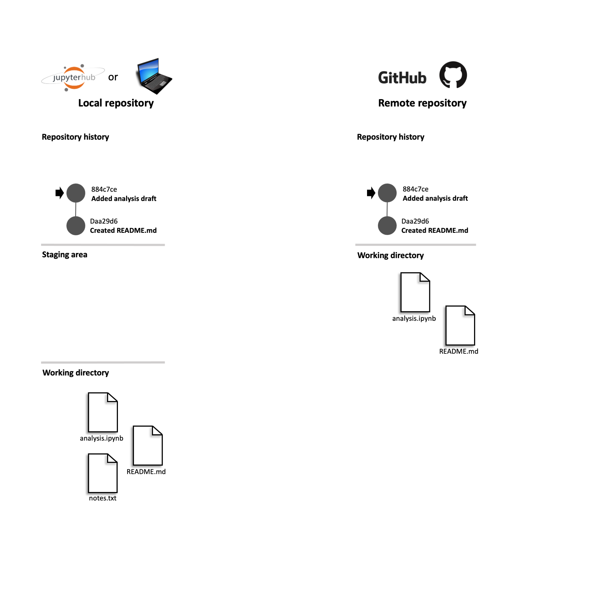

```{r setup, include=FALSE}
options(htmltools.dir.version = FALSE)
knitr::opts_chunk$set(message = FALSE, 
                      echo = FALSE, 
                      warning = FALSE,
                      fig.align = "center")
```

```{r xaringan-themer, include=FALSE, warning=FALSE}
library(xaringanthemer)
style_duo_accent(
  primary_color = "#9F999C",
  secondary_color = "#FFE5F3",
  inverse_header_color = "#8F8C8E",
  link_color = "deeppink",
  title_slide_text_color = "#3d3d3d",
  title_slide_background_image = "img/title-slide-background-light.png",
  title_slide_background_position = "left",
  header_font_google = google_font("Josefin Sans"),
  text_font_google   = google_font("Montserrat", "300", "300i"),
  code_font_google   = google_font("Fira Mono")
)
```

class: center, middle

> *You mostly collaborate with yourself, 
> and me-from-two-months-ago never responds to email.*
> 
> --Mark T. Holder

---

class: center, middle

## What is version control

.pull-left[

<br><br><br>

Version control is the process of keeping a record of changes to documents, including when the changes were made and who made them, throughout the history of their development.

It also provides the means both to view earlier versions of the project and to revert changes.

To version control a project, you generally need two things: a version control system and a repository hosting service. 

]

.pull-right[
```{r phd-comic, out.width="68%"}
knitr::include_graphics("img/version-control-intro/phdcomicid1531.png")
```
]

*Source: https://phdcomics.com/comics/archive_print.php?comicid=1531*

---

class: center, middle

## Why should I use it?

*Without deliberate 
and conscious effort towards tracking changes made to an analysis, 
projects tend to become messy*

```{r charlie-day-meme, out.width="50%"}
knitr::include_graphics("img/version-control-intro/charlie-day-meme.png")
```

*Source: https://imgflip.com/memegenerator/92459171/Charlie-Day*
---

class: middle

## Why should I use it?


.pull-left[

<br><br><br>

Version control software also facilitates collaboration via tools for:

- sharing edits with others 

- resolving conflicting edits

- democratic communication

- peer review

- project management

]

.pull-right[
```{r bicycle-gif, out.width="55%"}
knitr::include_graphics("img/version-control-intro/bicycle-gif.gif")
```
]

*Source: https://giphy.com/gifs/team-work-brocycle-3o6UBbsOZ3co6fJHLG*


---

## Version control repositories

Typically, when we put a data analysis project under version control, we create two copies of the repository:

```{r vc1-no-changes, out.width="53%"}

```

---

class: center

## Git versus GitHub

To version control a project, you generally need two things: a version control system (e.g., Git) and a repository hosting service (e.g., GitHub).

```{r git-vs-github, out.width="40%"}
# source: https://www.edureka.co/blog/how-to-use-github/
knitr::include_graphics("img/version-control-intro/git-vs-github.png")
```

*Source: https://www.edureka.co/blog/how-to-use-github/*
---

### References


### Credits

---

### Acknowledgements


---

class: inverse, center, middle

# Questions?


### TiffanyTimbers

#### talk slides: *[bit.ly/TBD](https://bit.ly/TBD)*
